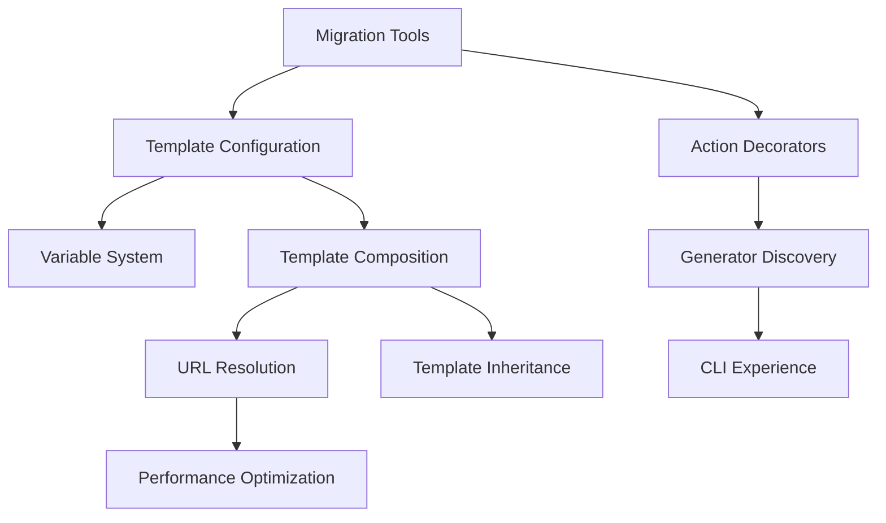

# Technical Implementation Documentation

This directory contains detailed technical implementation guides for Hypergen V8 features. Each document focuses on the "how" of implementing specific roadmap features.

## Documentation Structure

### Core V8 Implementation (Phase 1)
- [ ] **Template Configuration.md** - `template.yml` parsing, variable system, validation
- [ ] **URL Resolution.md** - GitHub/Gist/HTTP template fetching, caching, security
- [ ] **Variable System.md** - Rich types, validation, prompting, internal variables
- [ ] **Action Decorators.md** - `@action` decorator implementation, parameter handling
- [ ] **Generator Discovery.md** - Auto-discovery algorithms, scanning, validation
- [ ] **Template Composition.md** - `includes` processing, variable mapping, conflict resolution

### Developer Experience (Phase 2)
- [ ] **Development Tools.md** - Hot-reload, preview mode, validation, testing framework
- [ ] **File Based Routing.md** - Automatic path generation, naming conventions
- [ ] **CLI Experience.md** - Interactive discovery, help system, error handling
- [ ] **Migration Tools.md** - Yeoman/Hygen conversion, compatibility validation

### Advanced Features (Phase 3-4)
- [ ] **Template Inheritance.md** - Conflict resolution, conditional inclusion
- [ ] **Action System.md** - Lifecycle hooks, composition, built-in actions
- [ ] **Generator Registry.md** - Distribution, versioning, security validation
- [ ] **Performance Optimization.md** - Caching strategies, memory optimization
- [ ] **IDE Integration.md** - VS Code extension, syntax highlighting, IntelliSense

## Document Template

Each technical document should follow this structure:

```markdown
# Feature Name Implementation

## Overview
Brief description of what this feature does and why it's important.

## Architecture Integration
How this feature fits into the V8 architecture (Templates/Actions/Generators).

## Implementation Details
### Data Structures
Key interfaces, types, and data structures.

### Core Algorithms  
Step-by-step implementation approach.

### Error Handling
Error cases and recovery strategies.

## API Design
Public interfaces and usage examples.

## Testing Strategy
How to test this feature comprehensively.

## Performance Considerations
Performance implications and optimization strategies.

## Security Considerations
Security implications and mitigation strategies.

## Migration Path
How this affects existing functionality and migration strategies.

## Examples
Concrete examples of usage and edge cases.
```

## Implementation Principles

1. **Architecture Alignment**: All implementations must align with V8 architecture principles
2. **Performance First**: Document performance implications and optimization strategies
3. **Security by Design**: Address security considerations for each feature
4. **Comprehensive Testing**: Define clear testing strategies and coverage requirements
5. **Migration Friendly**: Plan migration paths for existing functionality

## Dependencies Between Documents



## Status Tracking

- 🟥 **Not Started** - Document not yet created
- 🟨 **In Progress** - Document being written
- 🟩 **Complete** - Document finished and reviewed
- 🔄 **Needs Update** - Document exists but needs updates for recent changes

| Document | Status | Phase | Priority |
|----------|--------|-------|----------|
| Template Configuration | 🟥 | 1 | High |
| Variable System | 🟥 | 1 | High |  
| Template Composition | 🟥 | 1 | High |
| URL Resolution | 🟥 | 1 | High |
| Action Decorators | 🟥 | 1 | High |
| Generator Discovery | 🟥 | 1 | Medium |
| Development Tools | 🟥 | 2 | Medium |
| File Based Routing | 🟥 | 2 | Medium |
| CLI Experience | 🟥 | 2 | Medium |
| Migration Tools | 🟥 | 2 | Low |

## Getting Started

When implementing a new V8 feature:

1. **Create the technical document first** using the template above
2. **Design the interfaces** and get feedback before coding
3. **Implement with tests** following the documented strategy
4. **Update the document** if implementation differs from design
5. **Mark as complete** when feature is fully implemented and tested

This approach ensures our implementation is well-planned, documented, and maintainable.